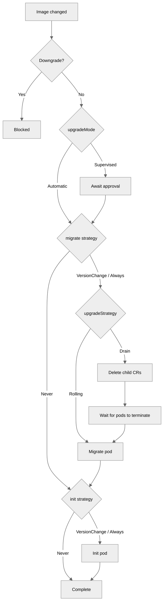

<!--
Licensed to the Apache Software Foundation (ASF) under one
or more contributor license agreements.  See the NOTICE file
distributed with this work for additional information
regarding copyright ownership.  The ASF licenses this file
to you under the Apache License, Version 2.0 (the
"License"); you may not use this file except in compliance
with the License.  You may obtain a copy of the License at

  http://www.apache.org/licenses/LICENSE-2.0

Unless required by applicable law or agreed to in writing,
software distributed under the License is distributed on an
"AS IS" BASIS, WITHOUT WARRANTIES OR CONDITIONS OF ANY
KIND, either express or implied.  See the License for the
specific language governing permissions and limitations
under the License.
-->

# Lifecycle

The operator manages database migrations and application initialization through
dedicated lifecycle tasks. This page covers configuration, behavior, and
troubleshooting.

## Overview

The `spec.lifecycle` section controls two sequential tasks:

1. **migrate** — `superset db upgrade` (database schema migration)
2. **init** — `superset init` (application initialization: roles, permissions)

Tasks run as bare Pods (`restartPolicy: Never`) managed by dedicated
`SupersetLifecycleTask` child CRs. The parent Superset controller orchestrates
sequencing, gating, and re-runs; the task controller manages pod lifecycle,
retries, and timeouts.

Lifecycle is enabled by default even when `spec.lifecycle` is nil; disable it
explicitly with `spec.lifecycle.disabled: true`.

**Key behaviors:**

- Migrate must complete before init starts
- Components are not created or updated until all enabled tasks complete
- When config or image changes require a re-run, the parent deletes the old task CR and creates a fresh one

## Task Strategies

Each task has a `strategy` that controls when it runs:

| Strategy | Behavior |
|---|---|
| `VersionChange` (default) | Task runs only when the Superset image changes |
| `Always` | Task runs on any spec change (image, config, or command) |
| `Never` | Task never runs (effectively disabled) |

With the default `VersionChange` strategy, config-only changes trigger rolling
restarts of component Deployments but do not spawn task pods.

```yaml
spec:
  lifecycle:
    migrate:
      strategy: VersionChange
    init:
      strategy: Always
```

## Upgrade Mode

The `upgradeMode` field controls how image upgrades are handled:

- **Automatic** (default) — tasks run immediately when an image change is detected
- **Supervised** — tasks wait for an annotation-based approval before running

```yaml
spec:
  lifecycle:
    upgradeMode: Supervised
```

When an image change is detected in supervised mode, the operator sets
`status.phase: AwaitingApproval` and records the upgrade context in
`status.lifecycle.upgrade`. Approve the upgrade by annotating the CR:

```bash
kubectl annotate superset my-superset superset.apache.org/approve-upgrade=true
```

The operator clears the annotation automatically after lifecycle tasks complete.
You can monitor the upgrade status with:

```bash
kubectl get superset my-superset -o jsonpath='{.status.lifecycle}'
```

The operator also performs semver comparison on image tags and blocks downgrades
to prevent accidental database corruption. A blocked downgrade sets
`status.phase: Blocked` — revert the image tag to resolve.

## Upgrade Strategy

The `upgradeStrategy` field controls component behavior during database migrations:

- **Rolling** (default) — lifecycle tasks run while existing components stay up. This works well for most minor/patch upgrades where migrations are additive and backward-compatible.
- **Drain** — all component child CRs are deleted before tasks run, ensuring no application pods are connected to the metastore during schema changes. After tasks complete, components are recreated with the new image.

Use `Drain` when:

- Migrations alter or drop existing columns/tables (breaking backward compatibility)
- You've experienced metastore deadlocks from concurrent access during migrations
- You want to ensure components always start fresh against the new schema (no stale state or incompatible ORM mappings)

```yaml
spec:
  lifecycle:
    upgradeStrategy: Drain
    migrate:
      strategy: VersionChange
    init:
      strategy: VersionChange
```

During a drain, Ingress/HTTPRoute and NetworkPolicy resources are preserved (they
are owned by the parent CR, not child CRs). Once lifecycle tasks complete,
components are recreated and traffic resumes automatically.

## Lifecycle Flow

The following diagram shows the lifecycle state machine. Optional steps activate
based on `upgradeMode` and `upgradeStrategy` settings.



For first deployments (no previous image), the flow starts at the strategy check
(no downgrade comparison or approval needed).

## Custom Commands

```yaml
spec:
  lifecycle:
    migrate:
      command: ["/bin/sh", "-c", "superset db upgrade && custom-migrate"]
    init:
      command: ["/bin/sh", "-c", "superset init && custom-seed"]
```

Both `adminUser` and `loadExamples` (see below) are mutually exclusive with a
custom `lifecycle.init.command` — when using these fields, the operator
constructs the full init command automatically.

## Timeout, Retries, and Pod Retention

Each task has configurable timeout and retry behavior:

```yaml
spec:
  lifecycle:
    podRetention:
      policy: RetainOnFailure    # Delete (default) | Retain | RetainOnFailure
    migrate:
      timeout: 10m               # max time per attempt (default: 5m)
      maxRetries: 5              # attempts before permanent failure (default: 3)
    init:
      timeout: 5m
      maxRetries: 3
```

On failure, the operator retries with exponential backoff (`10s * 2^(attempt-1)`,
capped at 5m). If a pod exceeds the timeout while Running or Pending, it counts
as a failed attempt.

**Pod retention policies:**

| Policy | On Success | On Failure |
|---|---|---|
| `Delete` (default) | Pod deleted | Pod deleted |
| `Retain` | Pod kept | Pod kept |
| `RetainOnFailure` | Pod deleted | Pod kept for debugging |

Use `RetainOnFailure` to inspect logs of failed migrations:

```bash
kubectl logs <pod-name> -c superset
```

## Admin User (Dev Mode Only)

In dev mode, the operator can create an admin user during initialization:

```yaml
spec:
  environment: dev
  lifecycle:
    init:
      adminUser:
        username: admin           # default
        password: admin           # default
        firstName: Superset       # default
        lastName: Admin           # default
        email: admin@example.com  # default
```

All fields have defaults, so `adminUser: {}` creates a user with
username/password `admin`/`admin`. The operator passes credentials as env vars
and appends a `superset fab create-admin` step to the init command. This field
is rejected in prod mode by CRD validation.

## Load Examples (Dev Mode Only)

Load Superset's example dashboards and datasets during initialization:

```yaml
spec:
  environment: dev
  lifecycle:
    init:
      loadExamples: true
```

The operator appends a `superset load-examples` step to the init command. This
field is rejected in prod mode by CRD validation. Note that Superset's built-in
examples require an admin user with username `admin` — if you customize
`adminUser.username`, example loading may fail.

## Lifecycle Pod Template

The `spec.lifecycle` section supports `podTemplate` with the same Pod and
container fields as other components (tolerations, nodeSelector, volumes, etc.
on `podTemplate`; env, resources, securityContext, etc. on
`podTemplate.container`), so task pods inherit top-level scheduling and security
settings and can be customized independently:

```yaml
spec:
  lifecycle:
    podTemplate:
      container:
        resources:
          limits:
            memory: "2Gi"
    migrate:
      command: ["/bin/sh", "-c", "superset db upgrade"]
```

## How It Works Under the Hood

### Why Bare Pods

- **Controlled retries** — The operator decides when and how to retry, with
  configurable max attempts and exponential backoff
- **Clean audit trail** — Each attempt creates a new Pod with a unique
  `generateName` suffix, making it easy to inspect history
- **Sidecar handling** — The operator manages pod lifecycle directly, avoiding
  the Job controller's sidecar termination issues

### Pod State Machine

Task pods transition through these states:

- **Pending** — No pod exists yet. The operator creates one.
- **Running** — Pod is executing. If it exceeds the timeout, it counts as a failed attempt.
- **Succeeded** → **Complete** — Task is done; the next task (or components) can proceed.
- **Failed** — If `attempts < maxRetries`, the operator deletes the pod and requeues with exponential backoff. If `attempts >= maxRetries`, the task is permanently failed.

### Pod Naming and Discovery

Pods use `generateName` (`{parent}-{task}-{random}`, e.g. `my-superset-migrate-x7k2m`)
for unique names per attempt. The operator discovers pods by label
(`superset.apache.org/instance` and `superset.apache.org/task`) and uses
the most recently created one when multiple exist.

### Task Pod Spec

Task pods inherit scheduling, security, volumes, and env from the top-level
`podTemplate`, just like other components. Key fields:

- **Image**: From `spec.image`
- **Command**: From `spec.lifecycle.migrate.command` or `spec.lifecycle.init.command` (defaults: `superset db upgrade` and `superset init`)
- **Config**: Mounted from the task ConfigMap (`{parent}-{task}-config`)
- **Env vars**: Database credentials, secret key (via plain env vars in dev mode, or `valueFrom.secretKeyRef` when `*From` fields are used)
- **Resources**: From `spec.lifecycle.podTemplate.container.resources` if set
- **Service account**: Inherited from parent spec
- **Restart policy**: Always `Never` — the operator handles retries

## Status Reporting

Lifecycle task progress is tracked per-task in the parent status:

```yaml
status:
  lifecycle:
    phase: Complete        # Idle | Draining | Migrating | Initializing | Complete | Blocked | AwaitingApproval
    migrate:
      state: Complete      # Pending | Running | Complete | Failed
      podName: my-superset-migrate-x7k2m
      startedAt: "2026-03-16T10:00:00Z"
      completedAt: "2026-03-16T10:00:12Z"
      duration: "12s"
      attempts: 1
      image: apache/superset:latest
    init:
      state: Complete
      podName: my-superset-init-a9b3k
      startedAt: "2026-03-16T10:00:13Z"
      completedAt: "2026-03-16T10:00:22Z"
      duration: "9s"
      attempts: 1
      image: apache/superset:latest
```

**Parent phase values related to lifecycle:**

| Phase | Meaning |
|---|---|
| `Initializing` | First deployment — lifecycle tasks running for the first time |
| `Upgrading` | Image change detected — lifecycle tasks running against new version |
| `Draining` | Drain strategy active — components being removed before running tasks |
| `Blocked` | Downgrade detected — lifecycle tasks will not run (manual intervention required) |
| `AwaitingApproval` | Supervised upgrade mode — waiting for approval annotation before proceeding |
